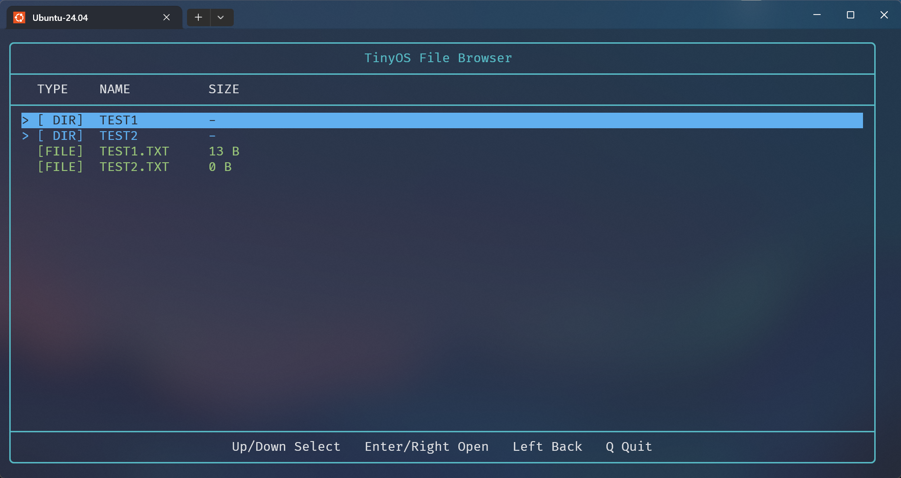
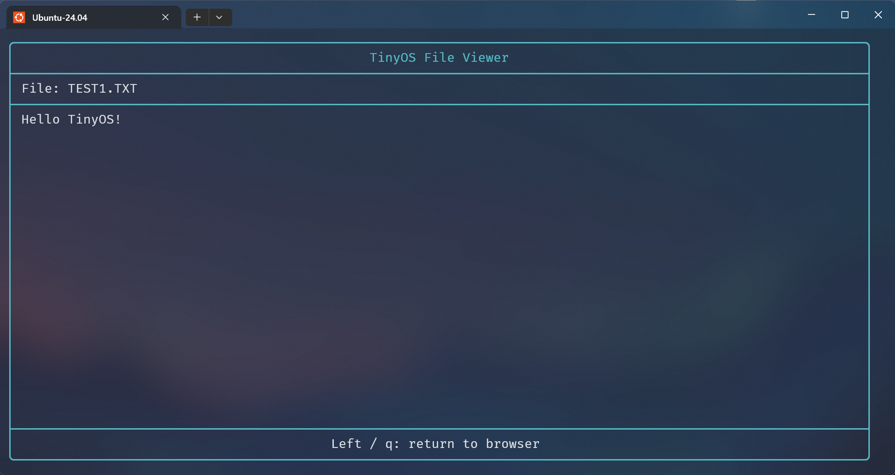

<div align="center">
    <h1>TinyOS</h1>
    <p><strong>A tiny RISC-V learning OS with a hand-built FAT12 filesystem and responsive terminal file browser.</strong></p>
</div>

TinyOS 是一个使用 Rust 编写的 RISC-V 裸机学习项目，运行在 QEMU virt 虚拟机上。

项目通过 VirtIO 块设备访问一个经典的 1.44 MB FAT12 磁盘镜像，并从零开始实现了 FAT12 文件系统。

在文件系统之上，tinyOS 还提供了一个交互式 Shell，以及使用 ANSI 控制序列实现的响应式全屏文件浏览器，可浏览目录、查看文件大小并直接预览文本文件。





## 快速开始

推荐在 Ubuntu / Debian 下运行本项目。

克隆本仓库：

```bash
git clone https://github.com/Antrairs/tinyOS.git
```

安装 qemu 模拟器：

```bash
sudo apt install -y qemu-system-misc
```

安装 Rust（若已安装可跳过）：

```bash
curl --proto '=https' --tlsv1.2 -sSf https://sh.rustup.rs | sh
. "$HOME/.cargo/env"
```

安装 RISC-V 裸机目标：

```bash
rustup target add riscv64gc-unknown-none-elf
```

首次运行时需要准备 1.44 MB 磁盘：

```bash
mkdir -p build
dd if=/dev/zero of=build/fat12.img bs=512 count=2880
```

启动 TinyOS：

```bash
cargo run
```

首次使用全零镜像时，在 `tinyOS>` 提示符下执行：

```bash
format
```

后续启动无需再次格式化。

退出 QEMU 按 Ctrl+A，松开后再按 X。

## 支持命令

当前提供：

| 命令 | 用法 | 描述 |
|---|---|---|
| `help` | `help` | 显示帮助 |
| `browse` | `browse` | 打开全屏文件浏览器 |
| `dir` | `dir` | 列出当前目录 |
| `touch` | `touch FILE` | 创建文件 |
| `mkdir` | `mkdir DIR` | 创建目录 |
| `cd` | `cd DIR` | 切换目录 |
| `write` | `write FILE TEXT` | 写入文件 |
| `type` | `type FILE` | 输出文件内容 |
| `format` | `format` | 格式化 FAT12 磁盘 |

## 实现进度

| 阶段 | 状态 | 备注 |
|---|---|---|
| 裸机启动 | ✅ | 基于 QEMU virt 设备的裸机启动 |
| UART 读写 | ✅ | 命令输入输出 |
| VirtIO 块设备 | ✅ | 持久化扇区读写 |
| FAT12 格式化 | ✅ | 从全零磁盘创建 FAT12 |
| FAT12 文件系统读写 | ✅ | 读取、修改、双 FAT 同步 |
| 簇分配 | ✅ | 分配、链接、释放 |
| 文件读写 | ✅ | 支持读写多簇文件 |
| 根目录项创建 | ✅ | 支持标准的 224 个根目录 |
| 子目录创建 | ✅ | `mkdir`、`.`、`..`、嵌套导航 |
| FAT 8.3 文件名 | ✅ | 创建与转换 |
| `fsck.fat` 验证 | ✅ | 标准 FAT12 工具可识别 |
| 全屏 TUI 浏览器 | ✅ | TUI 目录浏览、滚动、方向键 |
| TUI 响应式布局 | ✅ | 终端尺寸查询和回滚 |
| TUI 文件预览 | ✅ | 文本文件预览 |

## 技术取舍

TinyOS 以理解操作系统和文件系统的工作方式为目标。以下是技术选择。

**RISC-V**。相比于从历史包袱较重的 x86-64 指令集开始，RISC-V 的指令集和特权级设计相对清晰，秉承着不给自己找麻烦的原则，我选择用它为目标架构。

**Rust**。操作系统开发不可避免地需要和底层打交道，第一时间会想到用 C 语言实现。但是 Rust 的安全检查等特性在操作系统开发上很方便，再加上我本人也希望借助这个机会学习一下 Rust，于是最终选择了它。

**QEMU**。最流行的硬件模拟器之一。有了它我们就能在不直接接触硬件而是通过软件模拟的方式运行并测试操作系统内核的行为。

**VirtIO**。一套用于虚拟化环境的接口规范，它支持多种虚拟设备（我们主要用其提供的块设备做文件系统的读写操作），为将注意力聚集在文件系统本身，我使用了[virtio-drivers](https://docs.rs/virtio-drivers)进一步简化文件系统的驱动。

## 功能实现

### FAT12 简化设计

TinyOS 使用经典 1.44 MB FAT12 布局：

| 扇区 | 备注 |
|------|-----|
| 0 | 启动扇区 |
| 1-9 | FAT 表1 |
| 10-18 | FAT 表2 |
| 19-32 | 根目录 |
| 33-2879 | 数据区 |

但是做了一定程度的简化，只保留了必要参数用于文件系统的计算以及被标准检查工具识别。

核心参数为：

| 扇区 | 备注 |
|------|-----|
| 每扇区字节数 | 512 |
| 每簇扇区数 | 1 |
| FAT 副本数 | 2 |
| 根目录入口数 | 224 |
| 总扇区数 | 2880 |
| 每 FAT 表扇区数 | 9 |

### 命令实现

本项目实现了一个极简的 Shell。通过 UART 串口协议轮询接受输入，使用 MMIO 读取串口状态和数据寄存器，实现字符回显、退格和回车提交。

文件系统通过自定义的 BlockDevice 接口调用 VirtIO 扇区读写，修改持久化到宿主机的原始磁盘镜像。

**`help`** 通过 UART 串口协议以 MMIO 的方式在终端打印帮助信息。

**`browse`** 在受支持的终端中执行即可进入全屏文件浏览器。浏览器支持方向键选择、目录进入与返回、文件大小显示以及文本文件预览。TUI 直接使用 ANSI 终端控制序列，实现颜色、方向键、光标控制和响应式布局。

**`dir`** 枚举当前目录。根目录位于固定扇区，子目录位于数据区。程序以 32 字节为单位遍历目录项，遇到首字节为 `0x00` 时结束，遇到 `0xE5` 时跳过已删除项。从目录项中提取名称、属性、起始簇号和文件大小，供 Shell 和文件浏览器显示。

**`touch`** 创建文件格式为 FAT 8.3 的文件。将输入名称转换为 FAT 8.3 格式，名称占 8 字节，拓展名占 3 字节，不足的部分用空格补齐，小写英文字母转换为大写。创建前会检查同名目录项，然后寻找空闲或已删除的目录项，写入名称和文件属性。空文件不分配数据簇，起始簇号及大小均为 0。

**`mkdir`** 支持在任意目录创建目录项。子目录使用普通数据簇保存，并默认创建 `.` 和 `..` 两个特殊目录项。FAT12 根目录则保留其经典的固定 224 入口布局。

**`cd`** 切换目录。查找目标名称对应的目录项，检查其目录属性，并将当前目录簇号更新为目标目录的起始簇。

**`write`** 将文本写入文件。命令参数进一步分离文件名和文本内容，向已存在的文件写入内容，并拒绝将目录作为文件写入。当文件内容超过一个簇时，会继续分配空闲簇并链接到 FAT 链表；覆盖已有文件时，则先释放原有链表后重新分配。每次修改同时更新两份 FAT。

**`type`** 读取文件内容并打印到终端。通过目录项获取文件大小和起始簇号，沿 FAT 簇链逐簇读取，并按实际文件大小复制内容。

**`format`** 以 FAT12 格式化磁盘。可以从全零 1.44 MB 镜像直接创建 FAT12 文件系统或格式化原有文件系统。生成后的镜像可以在宿主机检查 `fsck.fat -vn build/fat12.img`。若未安装该工具运行下面的命令安装 `sudo apt install -y dosfstools`。

